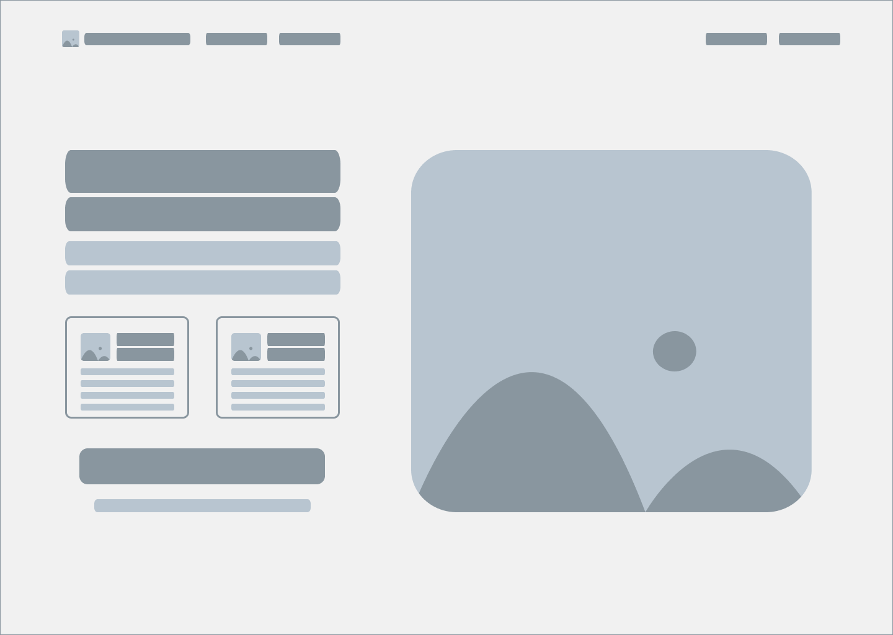
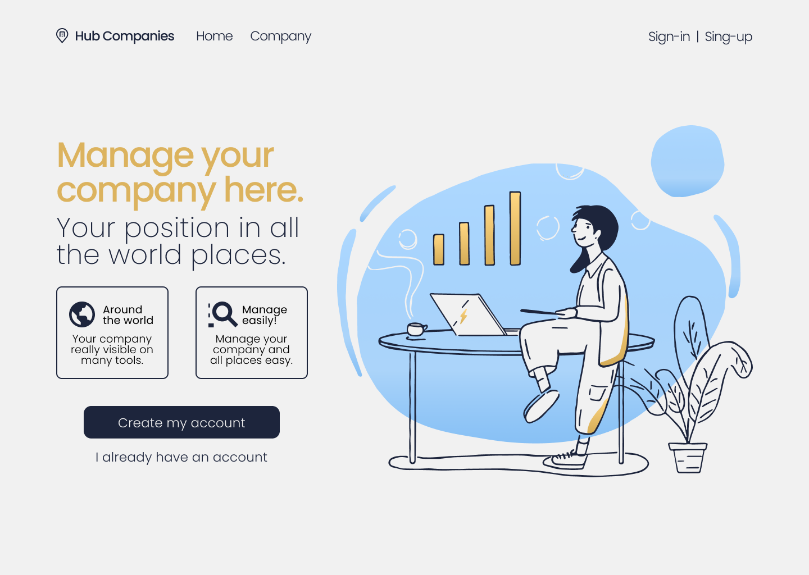

<h1 align="center">🏢 FRONT-END REACT 🌎</h1>

</br>

<div align="center"></div>

<div align="center">
</br>

</div>

> This project is running Fullstack (Backend and Frontend) in https://hubcompany.rickelmedias.dev/

<h3 align="center"> ENGLISH </h3>

> This Front-End was created by me (Rickelme), for a challenge , the Front-End have a CRUD for User, Companies, Places (Company branches). You also can give permissions (responsabilites) for other users watch your Company and create their places or see your places (all using my Back-End API created for this project).

<h3 align="center"> PORTUGUÊS </h4>

> Essa Front-End foi criada por mim (Rickelme), para um desafio , o Front-ENd possui um CRUD para Usuario, Empresas e Locais (Filiais da empresa). Você também pode dar permissões (responsabilidades) para outros usuários visualizarem sua Empresa e criar novos locais ou verem seus locais (todas essas funcionalidades acessando o Back-End API criado para esse projeto).

</br>
<div align="center">

<h3> Techs: </h3>


</br>
<h3> Design: </h3>


</div>

</br>
<hr/>
</br>

## 🤔 ABOUT THE IDEA 🤔

🤔 [QUAL A IDEIA DO PROJETO?](#ideia-do-projeto)


</br>

## 📖 DOCUMENTATION 📖

📖 [DOCUMENTACAO EM PORTUGUES](#DOCUMENTACAO-EM-PORTUGUES)


</br>

## 🚀 RESULTS 🚀

🚀 [RESULTADOS DO PROJETO](#resultados-do-projeto)


</br>
<hr/>
</br>

## IDEIA DO PROJETO

### Do desenvolvimento a produção
A ideia do projeto é conseguir aplicar uma integração completa de CRUD e interação entre tabelas, saindo praticamente de todo o zero com algumas tecnologias determinadas, como a utilização do REACT JS, até o Deploy no Heroku.

>" A ideia do porjeto é oferecer uma solução para o cliente criar contas e relacionar essas contas de seus sócios em suas empresas e filias dando a eles permissões para interagir. "

### Qual era o desafio do escopo
O projeto era bastante aberto quanto ao escopo, apesar de ter uma meta definida, a meta é conseguir montar um CRUD de Usuarios, Empresas e Locais (Filiais da Empresa) e interagir as tabelas do banco de dados.

### UI | UX
Desenvolvi utilizando Figma e libs para auxiliar o UI e UX da page Home e algumas outras, visualizando a facilitação do usuário para navegar na plataforma, como pode ser visto nos exemplos abaixo que fizeram parte do meu planejamento de front-end:

**Wireframe**

<details>

</details>
<br>

**Final Art**
<details>

</details>

### Conhecimentos absorvidos durante o projeto
Apesar de conhecer sobre Front-End e alguns Frameworks (Vue.js e Angular) o React.js era algo bem novo para mim, tendo visto apenas em alguns eventos de Next Level Week (NLW da Rocketseat), consegui aprender muito com a documentação oficial do framework, consegui sair do pouquissimo conhecimento com diversas análises para melhoria no código e melhores utilizações do frameworks, devo continuar atualização esse projeto para alcançar algumas metas, como aumentar o nível de componentização e aplicar alguns conhecimentos que aprendi como testes.

</br><hr/></br>

## DOCUMENTACAO EM PORTUGUES

</br>

## Configurações iniciais para rodar o serviço
Esse projeto em React é bastante simples de rodar, pois já esta totalmente configurado e em node.

Para iniciar vamos baixar os pacotes:

```sh
npm install
```

### Comandos para rodar a aplicação

Os principais comandos para rodar a aplicação são dois:
Para iniciar o frontend em modo de tests:

```sh
npm run start:dev
```

Se quiser rodar em produção e buildar o code:

```sh
npm run start:build:production
```

Para visualizar o back-end desse projeto entre em [HubCompany-Backend](https://github.com/RickelmeDias/HubCompany-Backend).

</br><hr/></br>

## Resultados do projeto

Apesar de notar diversas melhorias que desejo implementar, acredito que o projeto tenha atingido as minhas metas para o desafio, gostei bastante do resultado final, tanto de ui/ux quanto de usabilidade. Claro, assim como todos projetos que faço vejo pontos de melhora e eles existem, então devo atualizar com o tempo essas melhorias, como: aumentar componentização, aplicar testes e refatorar algumas partes.

</br><hr/></br>

## Developer / Desenvolvedor

> Developer who created this project. 💖

<div align="center">
<p align="center">
<br>
<a href="https://github.com/RickelmeDias">Rickelme Dias</a>
</p>
<div>